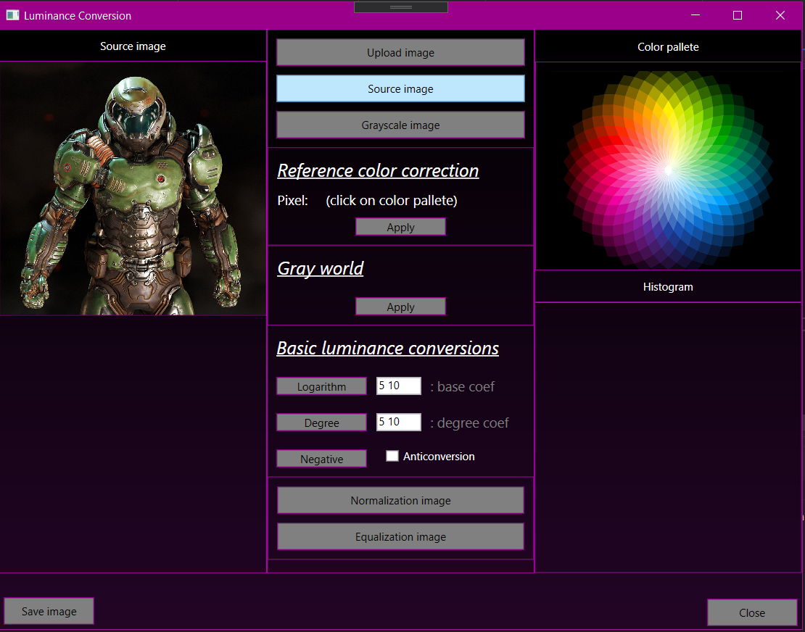

# ComputerVision
 
## Lab01 (C# (Versions: WinForms, WPF))

1. Загрузка изображения
2. Цветовая коррекция изображений
	- Коррекция с опорным цветом
	- Серый мир
	- По виду функции преобразования
3. Яркостная коррекция в интерактивном режиме по виду функции преобразования (необязательное дополнительное задание)
	- График функции кусочно линейный
	- График функции интерполируется сплайном
4. Коррекция на основе гистограммы
	- Нормализация гистограммы
	- Эквализация гистограммы  
	
	  
  
## Lab02 (C# (Versions: WinForms, WPF))

1. Загрузка изображения
2. Преобразование цветного к полутоновому
3. Бинаризация
	- Бинаризация с ручным выбором порога (верхняя, нижняя и по диапазону)
	- Бинаризация методом Оцу глобальная
	- Бинаризация методом Оцу локальная (с предварительным разбиением на фрагменты - по каждому своя бинаризация)
	- Бинаризация методом Оцу иерархическая (выполняется с иерархическим разбиением каждой уже полученной  области, пока возможно разбивать)
4. Квантование по яркости (с ручным заданием количества уровней)

## Lab03 (Python + OpenCV)

### Морфологические преобразования

## Lab04 (C# + EmguCV)

### Пространственная фильтрация
Выполнить улучшение изображения

## Lab05 (Python + OpenCV)

### Частотная фильтрация.
Для частотной фильтрации использовать БПФ (средствами OpenCV)

Показать в сравнении идеальный фильтр, Батерворта и гауссиан

 - Исходное изображение.
 - Спектр изображения
 - Частотный фильтр для сглаживания
 - Результат наложения в виде спектра и в виде изображения
 - Частотный фильтр для повышения резкости
 - Результат наложения в виде спектра и в виде изображения
 
 ## Lab06 (Python + OpenCV)
 
 ### Сегментация методами водораздела
